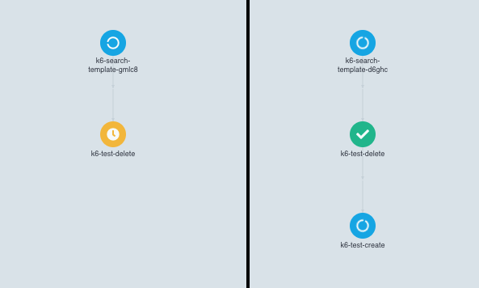

## Submitting a new workflow in Argo Workflows

1. Login into [Argo Workflows](https://argo-workflows.infra.internal.shared.empathy.co/workflows/k6) with your account.
2. Click on `Submit new workflow`.
3. Select `k6-search-template` as a workflow template. The default entrypoint is the main one. 
   * This template is maintained in [this repository](https://github.com/empathyco/platform-clusters/blob/main/charts/k6/templates/argo-workflows-search-template.yaml).
4. Type in the parameters you desire for launching the test and click on `submit`.

| name               | description                                                | example              |
|--------------------|------------------------------------------------------------|----------------------|
| team               | name of the team that launches the test                    | search               |
| scriptName         | name of the file containing the script                     | k6-test-real-data.js |
| configurationFile  | name of the file containing the configuration of the test  | test-config.json     |
| parallelism        | number of pods to launch the test                          | 10                   |
| k6RunnerImage      | image of k6 runner to be used                              | k6:v0.2.0            |
| cpuRequests        | desired cpu for each of the pods                           | 2000m                |
| cpuLimits          | limit in cpu for each of the pods                          | 2000m                |
| memoryRequests     | desired memory for each of the pods                        | 4Gi                  |
| memoryLimits       | limit in memory for each of the pods                       | 4Gi                  |

> Most of the time, the parameters to be specified will be the same as in the example column of the table.

The execution of this workflow is composed of two steps: deleting the containers and creating new ones with the new
configuration. You can check how it looks in here.

> Once the container is in the `creating` stage, it will start creating the pods specified in the `parallelism` parameter.

> The pods will start launching requests as soon as all of them are up and running.

## Stopping the execution of the test

1. Login into [Argo Workflows](https://argo-workflows.infra.internal.shared.empathy.co/workflows/k6) with your account.
2. Click on `Submit new workflow`.
3. Select `k6-search-template` as a workflow template.
4. Select `k6-test-delete` as entrypoint.
5. The pods will be deleted and the test will be stopped.